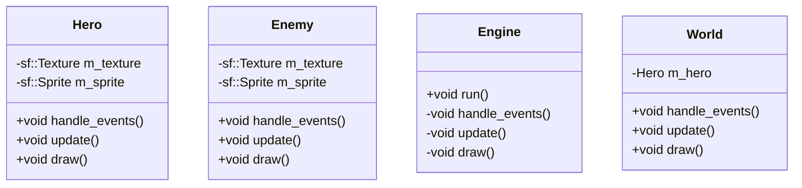

```mermaid
classDiagram
    class Hero{
        -sf::Texture m_texture
        -sf::Sprite m_sprite
        +void handle_events()
        +void update()
        +void draw()
    }

    class Enemy{
        -sf::Texture m_texture
        -sf::Sprite m_sprite
        +void handle_events()
        +void update()
        +void draw()
    }
    

    class Engine{
        +void run()
        -void handle_events()
        -void update()
        -void draw()
    }

    class World{
        -Hero m_hero
        +void handle_events()
        +void update()
        +void draw()
    }
```